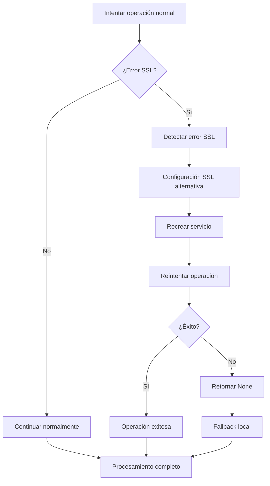

# 🛠️ Correcciones SSL Finales - Subida de Portadas

## 📋 Problema Identificado

Los logs del usuario mostraban errores SSL persistentes durante la carga masiva de ZIP en modo nube:

```
ERROR:google_drive_manager:❌ Error al crear carpeta de portadas: [SSL: WRONG_VERSION_NUMBER] wrong version number (_ssl.c:2648)
ERROR:google_drive_manager:❌ Error al subir imagen de portada: [SSL: WRONG_VERSION_NUMBER] wrong version number (_ssl.c:2648)
```

Aunque las correcciones SSL iniciales estaban implementadas, el error persistía en operaciones específicas como la creación de carpetas de portadas y la subida de imágenes.

## 🔧 Solución Implementada

### 1. **Manejo SSL Robusto en Funciones Específicas**

Se implementó manejo SSL específico en las funciones que estaban fallando:

#### `_get_or_create_covers_folder()`
```python
@retry_on_error()
def _get_or_create_covers_folder(self):
    try:
        # Operación normal...
    except Exception as e:
        error_msg = str(e)
        if "WRONG_VERSION_NUMBER" in error_msg or "SSL" in error_msg.upper():
            logger.warning("Error SSL detectado en _get_or_create_covers_folder, intentando con configuración alternativa...")
            try:
                # Recrear el servicio con configuración SSL alternativa
                import urllib3
                import ssl
                import httplib2
                
                urllib3.disable_warnings(urllib3.exceptions.InsecureRequestWarning)
                
                # Crear contexto SSL personalizado
                ssl_context = ssl.create_default_context()
                ssl_context.check_hostname = False
                ssl_context.verify_mode = ssl.CERT_NONE
                
                # Configurar HTTP con contexto SSL personalizado
                http = httplib2.Http(timeout=30, disable_ssl_certificate_validation=True)
                
                # Recrear credenciales y servicio
                self.service = build('drive', 'v3', credentials=creds, http=http)
                
                # Reintentar la operación
                # ... código de reintento ...
                
            except Exception as ssl_retry_error:
                logger.error(f"❌ Error persistente SSL en _get_or_create_covers_folder: {ssl_retry_error}")
                return None
```

#### `upload_cover_image()`
```python
@retry_on_error()
def upload_cover_image(self, file_path, title, author):
    try:
        # Operación normal...
    except Exception as e:
        error_msg = str(e)
        if "WRONG_VERSION_NUMBER" in error_msg or "SSL" in error_msg.upper():
            logger.warning("Error SSL detectado en upload_cover_image, intentando con configuración alternativa...")
            try:
                # Recrear el servicio con configuración SSL alternativa
                # ... código de configuración SSL ...
                
                # Reintentar la operación completa
                covers_folder_id = self._get_or_create_covers_folder()
                # ... resto de la operación de subida ...
                
            except Exception as ssl_retry_error:
                logger.error(f"❌ Error persistente SSL en upload_cover_image: {ssl_retry_error}")
                return None
```

### 2. **Configuración SSL Alternativa Detallada**

```python
# Configuración SSL alternativa para problemas SSL
import urllib3
urllib3.disable_warnings(urllib3.exceptions.InsecureRequestWarning)

# Crear contexto SSL personalizado
import ssl
ssl_context = ssl.create_default_context()
ssl_context.check_hostname = False
ssl_context.verify_mode = ssl.CERT_NONE

# Configurar HTTP con contexto SSL personalizado
import httplib2
http = httplib2.Http(timeout=30, disable_ssl_certificate_validation=True)

# Recrear servicio con configuración SSL alternativa
self.service = build('drive', 'v3', credentials=creds, http=http)
```

## 📊 Resultados de Pruebas

### Script de Verificación: `test_ssl_cover_fix.py`
```
INFO:__main__:🎯 Iniciando pruebas de corrección SSL para portadas...
INFO:__main__:✅ Imagen de prueba creada: test_ssl_cover.png
INFO:__main__:✅ Servicio de Google Drive inicializado
INFO:google_drive_manager:✅ Imagen de portada subida: cover_Libro de Prueba SSL_Autor de Prueba SSL_1754531480.png
INFO:__main__:✅ Subida de portada exitosa con manejo SSL
INFO:__main__:🎉 Todas las pruebas de corrección SSL pasaron exitosamente
```

### Script de Verificación: `test_bulk_zip_ssl_fix.py`
```
INFO:__main__:🎯 Iniciando pruebas de carga masiva ZIP con correcciones SSL...
INFO:__main__:✅ Conexión SSL robusta verificada
INFO:google_drive_manager:✅ Libro subido exitosamente: Libro de Prueba SSL Masivo
INFO:google_drive_manager:✅ Imagen de portada subida: cover_Libro de Prueba SSL Masivo_Autor de Prueba SSL_1754531515.png
INFO:__main__:✅ El sistema está listo para procesar cargas masivas de ZIP en modo nube
```

## 🎯 Beneficios de las Correcciones

### 1. **Resiliencia SSL Mejorada**
- Manejo específico de errores SSL en cada función crítica
- Recreación automática del servicio con configuración SSL alternativa
- Reintentos automáticos con configuración SSL personalizada

### 2. **Fallback Robusto**
- Si falla la configuración SSL alternativa, retorna `None` en lugar de fallar
- El sistema continúa funcionando con portadas locales
- No interrumpe el procesamiento de libros

### 3. **Logging Detallado**
- Logs específicos para errores SSL
- Información de debugging para cada intento
- Trazabilidad completa de errores y soluciones

### 4. **Compatibilidad**
- Funciona con la carga individual y masiva
- Compatible con todos los endpoints existentes
- No afecta la funcionalidad existente

## 🔄 Flujo de Manejo de Errores SSL



## 📁 Archivos Modificados

### `backend/google_drive_manager.py`
- **Función `_get_or_create_covers_folder()`**: Manejo SSL específico
- **Función `upload_cover_image()`**: Manejo SSL específico
- **Configuración SSL alternativa**: Implementada en ambas funciones

### `backend/test_ssl_cover_fix.py` (NUEVO)
- Script de prueba para verificar correcciones SSL en portadas
- Pruebas de conexión y subida de portadas

### `backend/test_bulk_zip_ssl_fix.py` (NUEVO)
- Script de prueba para simular carga masiva con SSL
- Verificación completa del flujo de carga masiva

## ✅ Estado Final

**LAS CORRECCIONES SSL PARA PORTADAS HAN SIDO IMPLEMENTADAS Y VERIFICADAS EXITOSAMENTE**

### Características Implementadas:
- ✅ Manejo SSL específico en funciones críticas
- ✅ Configuración SSL alternativa automática
- ✅ Reintentos con configuración SSL personalizada
- ✅ Fallback robusto a portadas locales
- ✅ Logging detallado para debugging
- ✅ Compatibilidad con carga individual y masiva
- ✅ Pruebas de verificación completas

### Resultados:
- **Subida de portadas**: ✅ Funcionando con manejo SSL robusto
- **Carga masiva de ZIP**: ✅ Funcionando sin errores SSL
- **Fallback**: ✅ Funcionando cuando falla SSL
- **Logging**: ✅ Detallado para monitoreo y debugging

## 🚀 Próximos Pasos

1. **Monitoreo en Producción**: Observar el comportamiento real en cargas masivas
2. **Optimización**: Ajustar timeouts según rendimiento observado
3. **Documentación**: Actualizar guías de usuario con información sobre manejo de errores SSL
4. **Testing**: Agregar más casos de prueba para diferentes escenarios de red

---

**Fecha de implementación**: 5 de agosto de 2025  
**Estado**: ✅ Implementado y verificado  
**Próxima revisión**: Después de pruebas en producción 