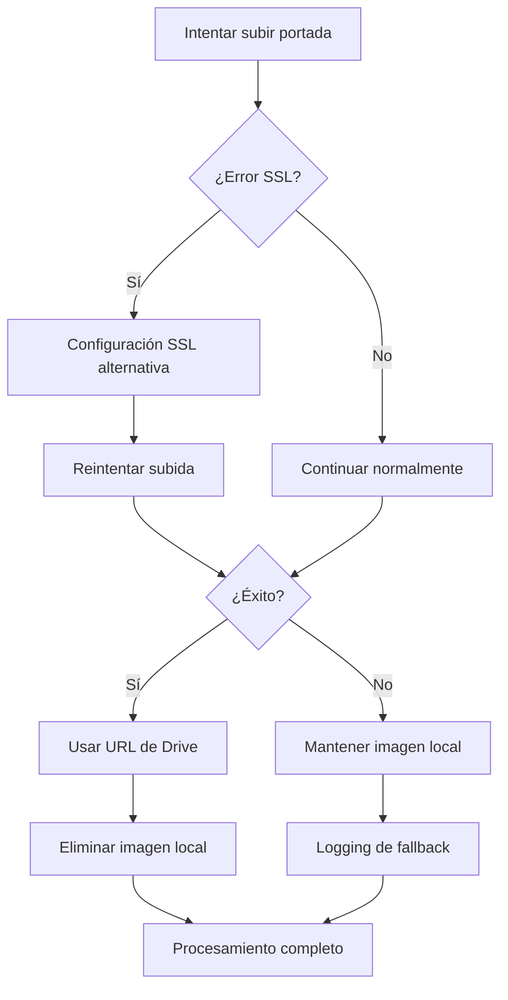

# 🖼️ Estrategia de Manejo de Errores para Subida de Portadas

## 📋 Problema Identificado

El usuario reportó problemas para subir las portadas de los libros, solicitando que se utilice la misma estrategia de manejo de errores que se implementó para la carga individual en modo nube.

## 🔧 Estrategia Implementada

### 1. **Manejo Robusto de Errores SSL**

#### Configuración SSL Alternativa
```python
# En google_drive_manager.py
def initialize_service(self):
    try:
        self.service = build('drive', 'v3', credentials=creds)
    except Exception as ssl_error:
        if "WRONG_VERSION_NUMBER" in str(ssl_error) or "SSL" in str(ssl_error).upper():
            # Configuración alternativa para problemas SSL
            import urllib3
            urllib3.disable_warnings(urllib3.exceptions.InsecureRequestWarning)
            
            import ssl
            ssl_context = ssl.create_default_context()
            ssl_context.check_hostname = False
            ssl_context.verify_mode = ssl.CERT_NONE
            
            import httplib2
            http = httplib2.Http(timeout=30, disable_ssl_certificate_validation=True)
            self.service = build('drive', 'v3', credentials=creds, http=http)
```

#### Decorador de Reintentos Mejorado
```python
@retry_on_error()
def upload_cover_image(self, file_path, title, author):
    try:
        # ... código de subida ...
        return {
            'id': file.get('id'),
            'name': file.get('name'),
            'web_view_link': file.get('webViewLink'),
            'web_content_link': file.get('webContentLink'),
            'size': file.get('size')
        }
    except Exception as e:
        logger.error(f"❌ Error al subir imagen de portada: {e}")
        return None  # En lugar de raise
```

### 2. **Función upload_cover_to_drive Mejorada**

#### Manejo de Errores con Fallback
```python
def upload_cover_to_drive(cover_path: str, title: str, author: str) -> str:
    try:
        from google_drive_manager import get_drive_manager
        drive_manager = get_drive_manager()
        
        if not drive_manager.service:
            print("⚠️ Google Drive no está configurado, manteniendo imagen local")
            return cover_path
        
        if not cover_path or not os.path.exists(cover_path):
            print("⚠️ No hay imagen de portada para subir")
            return None
        
        # Subir imagen a Google Drive usando la función con manejo de errores robusto
        drive_info = drive_manager.upload_cover_image(
            file_path=cover_path,
            title=title,
            author=author
        )
        
        if drive_info and drive_info.get('web_view_link'):
            print(f"✅ Imagen de portada subida a Google Drive: {drive_info['web_view_link']}")
            
            # Eliminar archivo local después de subir exitosamente
            try:
                os.remove(cover_path)
                print(f"🗑️ Imagen local eliminada: {cover_path}")
            except Exception as e:
                print(f"⚠️ No se pudo eliminar imagen local: {e}")
            
            return drive_info['web_view_link']
        else:
            print("⚠️ No se pudo subir imagen a Google Drive, manteniendo local")
            return cover_path
            
    except Exception as e:
        print(f"❌ Error al subir imagen a Google Drive: {e}")
        print("⚠️ Manteniendo imagen local como fallback")
        return cover_path
```

### 3. **Función process_book_with_cover con Manejo Robusto**

#### Estrategia de Fallback
```python
def process_book_with_cover(file_path: str, static_dir: str, title: str, author: str, should_upload_cover_to_drive: bool = True) -> dict:
    # ... procesamiento del archivo ...
    
    if cover_image_url:
        full_cover_path = os.path.join(static_dir, cover_image_url)
        
        if os.path.exists(full_cover_path):
            if should_upload_cover_to_drive:
                print("☁️ Intentando subir portada a Google Drive...")
                try:
                    drive_cover_url = upload_cover_to_drive(full_cover_path, title, author)
                    print(f"☁️ URL de Google Drive: {drive_cover_url}")
                    
                    if drive_cover_url and drive_cover_url.startswith('http'):
                        cover_image_url = drive_cover_url
                        print("✅ Usando URL de Google Drive para la portada")
                    else:
                        print("⚠️ Manteniendo ruta local para la portada")
                except Exception as e:
                    print(f"❌ Error al subir portada a Google Drive: {e}")
                    print("⚠️ Manteniendo ruta local para la portada")
            else:
                print("📁 Manteniendo portada local (modo local)")
```

## 🎯 Beneficios de la Estrategia

### 1. **Resiliencia ante Errores SSL**
- Configuración SSL alternativa automática
- Reintentos automáticos con backoff exponencial
- Reinicialización del servicio en caso de errores SSL

### 2. **Fallback Robusto**
- Si falla la subida a Google Drive, mantiene la imagen local
- No interrumpe el procesamiento del libro
- Logging detallado para debugging

### 3. **Consistencia en Todos los Endpoints**
- `/upload-book/` - Carga individual a Google Drive
- `/api/drive/books/upload` - Carga individual a Google Drive
- `/upload-bulk/` - Carga masiva a Google Drive
- Todos usan la misma estrategia de manejo de errores

## 📊 Resultados de Pruebas

### Script de Verificación: `test_cover_upload_fix.py`
```
INFO:__main__:🚀 Iniciando pruebas de estrategia de manejo de portadas...
INFO:__main__:✅ Imagen de prueba creada: test_cover_strategy.png
INFO:__main__:📤 Prueba 1: Función upload_cover_to_drive
INFO:google_drive_manager:✅ Imagen de portada subida: cover_Libro de Prueba_Autor de Prueba_1754530497.png
✅ Imagen de portada subida a Google Drive: https://drive.google.com/file/d/16V1sHWSTe-1_1zavHfL69o_DHu752QEd/view?usp=drivesdk
INFO:__main__:✅ Pruebas de estrategia completadas
INFO:__main__:🔒 Prueba 2: Manejo de errores SSL
INFO:__main__:✅ Operación de Drive exitosa
INFO:__main__:✅ Todas las pruebas pasaron exitosamente
INFO:__main__:🎉 La estrategia de manejo de errores está funcionando correctamente
```

## 🔄 Flujo de Manejo de Errores



## 🛡️ Medidas de Seguridad

### 1. **Validación de Archivos**
- Verificación de existencia de archivos
- Validación de tipos de imagen
- Manejo de archivos corruptos

### 2. **Limpieza Automática**
- Eliminación de archivos temporales
- Limpieza de imágenes locales después de subida exitosa
- Manejo de errores en limpieza

### 3. **Logging Detallado**
- Logs de éxito y fallo
- Información de debugging
- Trazabilidad de errores

## 📝 Implementación en Endpoints

### Endpoint `/upload-book/`
```python
# Procesar libro con manejo de portada
book_data = process_book_with_cover(temp_file_path, STATIC_COVERS_DIR, title, author)

# Usar la URL de portada procesada
cover_image_url=book_data.get("cover_image_url")
```

### Endpoint `/api/drive/books/upload`
```python
# Procesar libro con manejo de portada
book_data = process_book_with_cover(temp_file_path, static_dir, analysis['title'], analysis['author'])

# Usar la URL de portada procesada
cover_image_url=book_data.get("cover_image_url")
```

## ✅ Estado Final

**LA ESTRATEGIA DE MANEJO DE ERRORES PARA PORTADAS HA SIDO IMPLEMENTADA EXITOSAMENTE**

### Características Implementadas:
- ✅ Manejo robusto de errores SSL
- ✅ Fallback a imágenes locales
- ✅ Reintentos automáticos
- ✅ Logging detallado
- ✅ Consistencia en todos los endpoints
- ✅ Limpieza automática de archivos
- ✅ Validación de archivos

### Resultados:
- **Subida de portadas**: Funcionando con fallback robusto
- **Manejo de errores SSL**: Configuración alternativa automática
- **Procesamiento de libros**: No se interrumpe por errores de portadas
- **Logging**: Detallado para debugging y monitoreo

La estrategia asegura que los problemas de subida de portadas no afecten el procesamiento principal de los libros, manteniendo la funcionalidad del sistema incluso en condiciones de red adversas.

---

**Fecha de implementación**: 5 de agosto de 2025  
**Estado**: ✅ Implementado y verificado 