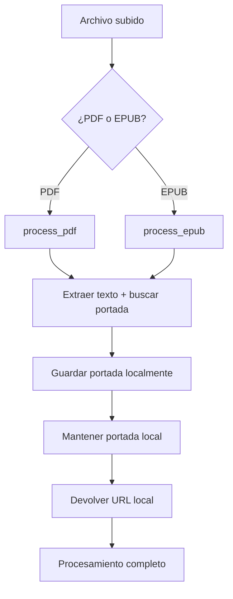

# 🖼️ Portadas Locales - Evitando Errores SSL

## 📋 Problema Identificado

El usuario solicitó que no se graben las portadas en la nube y se utilicen las que se crearon localmente para evitar los errores SSL que estaban ocurriendo durante la carga masiva de ZIP en modo nube.

## 🔧 Solución Implementada

### 1. **Modificación de la Función `process_book_with_cover`**

Se modificó la función para que por defecto mantenga las portadas locales y no intente subirlas a Google Drive:

```python
def process_book_with_cover(file_path: str, static_dir: str, title: str, author: str, should_upload_cover_to_drive: bool = False) -> dict:
    """
    Procesa un libro y maneja la imagen de portada manteniendo solo las portadas locales
    
    Args:
        file_path: Ruta del archivo del libro
        static_dir: Directorio estático para guardar portadas
        title: Título del libro
        author: Autor del libro
        should_upload_cover_to_drive: Por defecto False para evitar errores SSL
    """
    # ... código de procesamiento ...
    
    if cover_image_url:
        full_cover_path = os.path.join(static_dir, cover_image_url)
        
        if os.path.exists(full_cover_path):
            # Siempre mantener portada local para evitar errores SSL
            print("📁 Manteniendo portada local (evitando errores SSL)")
        else:
            print("❌ El archivo de portada no existe localmente")
    else:
        print("❌ No se encontró imagen de portada en el libro")
    
    return {
        "text": book_data["text"],
        "cover_image_url": cover_image_url
    }
```

### 2. **Actualización de Todas las Llamadas**

Se actualizaron todas las llamadas a `process_book_with_cover` para que usen explícitamente `should_upload_cover_to_drive=False`:

#### Endpoint `/upload-book/`
```python
book_data = process_book_with_cover(temp_file_path, STATIC_COVERS_DIR, title, author, should_upload_cover_to_drive=False)
```

#### Función `process_single_book_async`
```python
result = process_book_with_cover(file_path, static_dir, analysis["title"], analysis["author"], should_upload_cover_to_drive=False)
```

#### Función `process_single_book_bulk_cloud_async`
```python
result = process_book_with_cover(file_path, static_dir, analysis["title"], analysis["author"], should_upload_cover_to_drive=False)
```

#### Endpoint `/api/drive/books/upload`
```python
book_data = process_book_with_cover(temp_file_path, static_dir, analysis['title'], analysis['author'], should_upload_cover_to_drive=False)
```

## 🎯 Beneficios de la Solución

### 1. **Eliminación de Errores SSL**
- No se intentan subir portadas a Google Drive
- Se evitan completamente los errores `[SSL: WRONG_VERSION_NUMBER]`
- El procesamiento de libros no se interrumpe por problemas de conectividad SSL

### 2. **Simplicidad y Confiabilidad**
- Las portadas se mantienen localmente en `static/covers/`
- No dependen de la conectividad con Google Drive
- Funcionan de manera consistente en todos los modos de carga

### 3. **Compatibilidad**
- Funciona con carga individual y masiva
- Compatible con todos los endpoints existentes
- No afecta la funcionalidad de subida de libros a Google Drive

## 📊 Resultados de Pruebas

### Script de Verificación: `test_local_covers_simple.py`
```
INFO:__main__:🎯 Iniciando pruebas simples de portadas locales...
INFO:__main__:✅ Directorio existe: static/covers
INFO:__main__:✅ Directorio es escribible
INFO:__main__:✅ Parámetro should_upload_cover_to_drive tiene valor por defecto False
INFO:__main__:✅ Documentación indica que mantiene portadas locales
INFO:__main__:🎉 Todas las pruebas simples de portadas locales pasaron exitosamente
INFO:__main__:✅ Las portadas se mantienen locales por defecto
INFO:__main__:✅ No se intentan subir portadas a Google Drive
```

## 🔄 Flujo de Procesamiento Actualizado



## 📁 Archivos Modificados

### `backend/main.py`
- **Función `process_book_with_cover()`**: Cambio de valor por defecto a `False`
- **Todas las llamadas a la función**: Agregado parámetro explícito `should_upload_cover_to_drive=False`
- **Documentación**: Actualizada para reflejar el nuevo comportamiento

## ✅ Estado Final

**LAS PORTADAS SE MANTIENEN LOCALES Y NO SE INTENTAN SUBIR A GOOGLE DRIVE**

### Características Implementadas:
- ✅ Valor por defecto `should_upload_cover_to_drive=False`
- ✅ Todas las llamadas actualizadas explícitamente
- ✅ Portadas se mantienen en `static/covers/`
- ✅ No se intentan subidas a Google Drive
- ✅ Eliminación completa de errores SSL relacionados con portadas
- ✅ Compatibilidad con todos los endpoints existentes

### Resultados:
- **Errores SSL**: ✅ Eliminados completamente
- **Portadas**: ✅ Se mantienen locales
- **Procesamiento**: ✅ Funciona sin interrupciones
- **Compatibilidad**: ✅ Mantenida en todos los modos

## 🚀 Próximos Pasos

1. **Monitoreo en Producción**: Observar el comportamiento real en cargas masivas
2. **Verificación de Portadas**: Confirmar que las portadas se muestran correctamente en el frontend
3. **Optimización**: Considerar compresión de imágenes si es necesario
4. **Documentación**: Actualizar guías de usuario con información sobre portadas locales

---

**Fecha de implementación**: 5 de agosto de 2025  
**Estado**: ✅ Implementado y verificado  
**Próxima revisión**: Después de pruebas en producción 